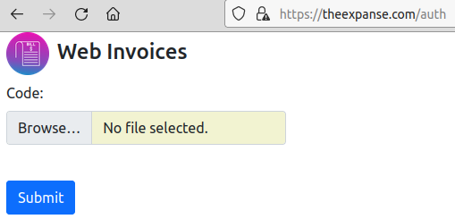
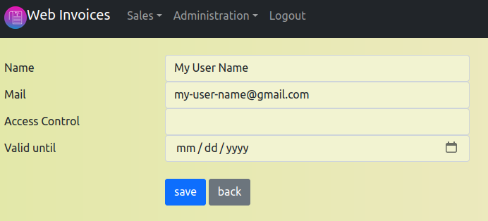
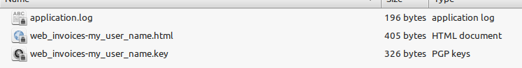
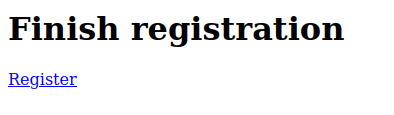

# Invoice applicaton for SQLite and MySQL

A simple, lightweight web application to manage customer data and products and create invoices in PDF format. Since no complex framework is used, the application is not only fast, but also takes up little space in the file system.

Although this is a feasibility study for fast web development, the application is fully functional and can be easily extended.

The application runs on both SQLite and MySQL databases. If web connectivity is not desired, the application can also run on a local computer using PHP's own built-in-server.

## Installation

Download the package and unpack the archive on a local computer. Depending on which database you want the application to run on, you will need to make changes to the ".config.php" file.

### (a) SQLite
If you want to use SQLite, you don't need to make any changes, because SQLite is assumed to be the default database.

The setting looks like this:

```PHP
$storage_location='../storage/';
$db_name='data.db';
```

The entry means that a SQLite database with the name "data.db" in the directory "../storage/" should be used.

### (b) MySQL
To use MySQL, the entries must be completed as follows:


```PHP
$storage_location='../storage/';
$db_type='MYSQL';
$db_name='db_test';
$db_host='localhost';
$db_user='db_test';
$db_password='db_password';
```

The entry means, a MySQL database with the name "db_test" on the host "localhost" should be used. The database user in this case is "db_test" and the password is "db_password".

### (c) Configure mail
The application sends mails when necessary. If you want to use this function, you have to modify the following entries in the ".config.php" file and remove comments:

```PHP
// SMTP
// $smtp_host = '';
// $smtp_auth = true;
// $smtp_port = 465;
// $smtp_secure = 'ssl';
// $smtp_username = '';
// $smtp_password = '';
// $smtp_from = '';
// $smtp_fromname = '';
```

### (d) Connect web space
Now you can transfer the directory structure to the web space. Connect the "public folder" to the "domain". The "public folder" is located inside the main folder - this ensures that only the contents of the public folder are visible from the outside.

### (e) Create database tables
For **SQLite** you do not need to do anything else. The corresponding database is included in the package and all tables are present.

For **MySQL** you enter your domain with the addition *"/init "*. For example, if your domain is *"example.com "* then enter *"example.com/init "*.  The browser should then display

creating models...
creating models succesfull

## Login
The application uses a keycode file instead of the classic user/password login, which is stored either on the client or on a USB stick. The keycode file is associated with both the client and the user - so no other client can use the keycode file to log in.

### Initial login without any user
When you enter your domain in the browser comes the following login:



As the first user of the system, use the supplied KeyCode file *"initial.key "* and confirm. This is your **first and unique** login. After that, select Administration|Users and create a new user for yourself:



Leave the "Valid Until" field open - otherwise you will not be able to log in yourself after the entered time has expired. After that you will be automatically logged out again and the login window will appear. You can close this window now because you have to register successfully first. If you have set up mail delivery and entered a correct mail address, you should have received a mail with a link to register, and your new, future keycode file. If this is not the case, it is stupid but no problem. In the directory "/tmp" the two files were created:

.

Download these two files from the server and open the html file with the browser. Then appears:



After you select "Register" the registration will appear again. The other file is your keycode file which you should keep and use now and in the future.

**Note:** The registration is only valid for 24 hrs and expires after that.

### More users
If you need more users, just create a new one and proceed as described before.

### No Login at all
If you dont mind a login at all, because you run the application on a local computer with no public access, you can change the following lines in the file "index.php" in the public folder:

#### 1. Login required
  
```PHP
// login required
Router::instance()->setAuth('auth', [Helper::class,'is_logged_in'] )->run();

// NO login required
//helper::is_logged_in();
//Router::instance()->run();
```

#### 2. NO Login
  
```PHP
// login required
//Router::instance()->setAuth('auth', [Helper::class,'is_logged_in'] )->run();

// NO login required
helper::is_logged_in();
Router::instance()->run();
```

### FAQ
If the configuration of a client changes, or a new computer is purchased that is not recognized, a new registration will be provided. Click this registration link in your mail and use your keycode file as usual. 

If you want to extend the application, set:

1. a model in "app\models
2. put a controller in "app\controller
3. add a new menu item in "app\libs\menu
4. add a new route in "app\libs\Routes
   
Details about the usage of "DBCrud" can be found in "app\libs\dbgrid\readme.md" and "Formbuilder" in "app\libs\Formbuilder\readme.md".